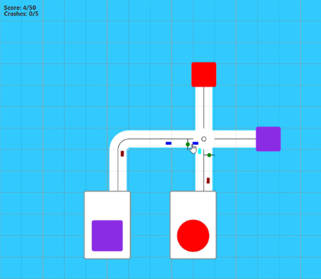
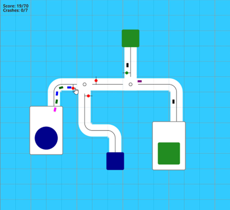
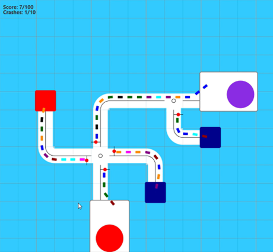
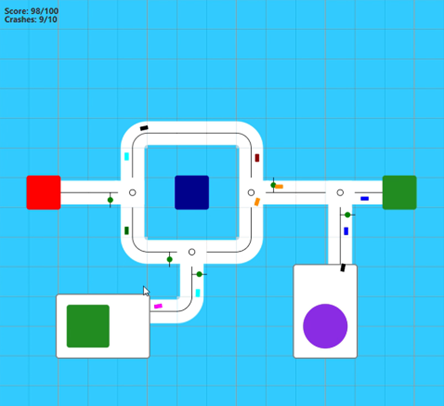
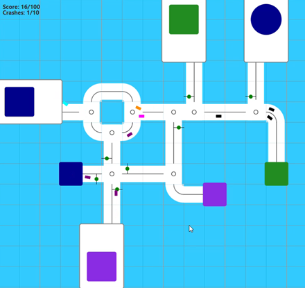

<!DOCTYPE html>
<html lang="en">
<head>
    <meta charset="UTF-8">
    <meta name="viewport" content="width=device-width, initial-scale=1.0">
</head>
<body>

<h1>Traffic Control Simulator</h1>

A simple traffic control simulation game built with Java and JavaFX.

<h2>Description</h2>

In this project, we created a simple mobile control simulation game using the JavaFx development system. The game includes:

<ul>
    <li>A start menu with a level selection menu featuring 5 different maps.</li>
    <li>Maps with varying winning and losing conditions.</li>
    <li>Levels that are created based on input files.</li>
</ul>

<h3>Gameplay</h3>
<ul>
    <li>From the start menu, users can either exit the game or proceed to the level selection menu.</li>
    <li>Users can select a level in the level selection menu or switch between levels by winning at the current level.</li>
    <li>Each map requires a certain number of vehicles to reach their destination to win.</li>
    <li>If the number of vehicles that reach the destination meets the required amount, the player wins the map and can move on to the next level or return to the level selection menu.</li>
    <li>Each map also has a limit on the number of car crashes allowed. If this limit is reached, the map fails, and the player can choose to exit or replay the map.</li>
    <li>Vehicles are generated randomly on the map with speeds proportional to the distance they need to travel.</li>
</ul>

We aimed to make the game fun with effective transition effects and sound effects triggered by in-game actions.

<h2>Screenshots</h2>

<h2>Installation</h2>

To run this project locally, follow these steps:

<ol>
    <li>Clone the repository:</li>
    <pre><code>git clone https://github.com/Nuraddin0/TrafficControlSimulator.git
cd TrafficControlSimulator
</code></pre>
    <li>Ensure you have Java and JavaFX installed on your machine.</li>
    <li>Compile and run the project using your preferred Java IDE or from the command line:</li>
    <pre><code>javac -cp .:path/to/javafx-sdk/lib/* Main.java
java -cp .:path/to/javafx-sdk/lib/* Main
</code></pre>
</ol>

<h2>Usage</h2>
<ul>
    <li>Start the game and select a level from the level selection menu.</li>
    <li>Guide the vehicles to their destinations while avoiding crashes.</li>
    <li>Use the menu options to navigate between levels or exit the game.</li>
</ul>

<h2>Features</h2>
<ul>
    <li>5 unique maps with different winning and losing conditions.</li>
    <li>Dynamic vehicle generation and speed adjustments.</li>
    <li>Effective transition and sound effects.</li>
    <li>Level progression and replay options.</li>
</ul>

<h2>Technologies Used</h2>
<ul>
    <li>Java</li>
    <li>JavaFX</li>
</ul>

<h2>Contributing</h2>

Contributions are welcome! Please follow these steps:

<ol>
    <li>Fork the repository.</li>
    <li>Create your feature branch (<code>git checkout -b feature/AmazingFeature</code>).</li>
    <li>Commit your changes (<code>git commit -m 'Add some AmazingFeature'</code>).</li>
    <li>Push to the branch (<code>git push origin feature/AmazingFeature</code>).</li>
    <li>Open a pull request.</li>
</ol>

<h2>License</h2>

This project is licensed under the MIT License. See the LICENSE file for details.

</body>
</html>
